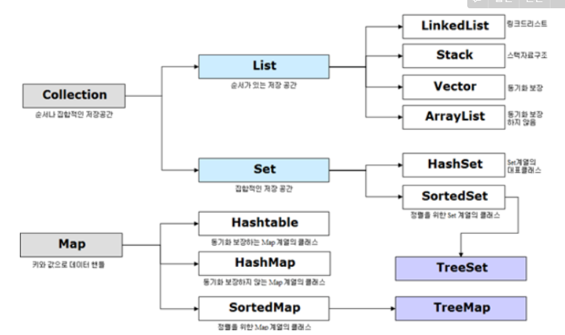

# JAVA

:pencil2: [**객체지향 프로그래밍과 절차지향 프로그래밍의 차이를 설명해보세요.**](#객체지향-프로그래밍과-절차지향-프로그래밍의-차이를-설명해보세요)

:pencil2:[**​ 객체지향 프로그래밍의 특징을 말해보세요.**](#객체지향-프로그래밍의-특징을-말해보세요.)

:pencil2: [**객체지향 설계 5원칙에 대해 설명해보세요.**](#객체지향-설계-5원칙에-대해-설명해보세요.)

:pencil2: [**오버로딩과 오버라이딩에 대해 설명해보세요.​**](#오버로딩과-오버라이딩에-대해-설명해보세요.)

:pencil2: [**클래스와 객체의 차이는 무엇인가요?**](#클래스와-객체의-차이는-무엇인가요?)

:pencil2: [**객체와 인스턴스의 차이는 무엇인가요?**](#객체와-인스턴스의-차이는-무엇인가요)

:pencil2: [Collection](#Collection)

  

 

### :pencil2: 객체지향 프로그래밍과 절차지향 프로그래밍의 차이를 설명해보세요.

- 절차 지향 : 순서가 중요한 프로그래밍, 컴퓨터 작업 처리 방식과 유사하기 때문에 객체 지향 언어보다 빠르다 예시로는 c언어가 있음, 유지보수 어렵고 실행 순서가 정해져있어서 코드 순서가 바뀌면 순서를 보장하기 힘듦, 데이터 중심으로 함수를 구현
- 객체 지향 : 실제 세계를 모델링하여 소프트웨어를 개발하는 방법, 객체간의 관계/조직에 초점을 두고있다. 기능 중심으로 메서드 구현
- 서로 반대되는 개념이 아니다.

 

### :pencil2: 객체지향 프로그래밍의 특징을 말해보세요.

1. 추상화

   - 객체들의 공통적인 특징(기능, 속성)을 도출하는 것
   - 객체지향적 관점에서는 클래스를 정의하는 것을 추상화라고 할 수 있다.(클래스가 없는 객체지향 언어도 존재 ex.JavaScript)

2. 캡슐화

   - 실제로 구현되는 부분을 외부에 드러나지 않도록 하여 정보를 은닉할 수 있다.(ex. getter/setter)
   - 객체가 독립적으로 역할을 할 수 있도록 데이터와 기능을 하나로 묶어 관리하는 것
   - 코드가 묶여있어서 오류가 없어 편리하다.
   - 데이터를 보이지 않고 외부와 상호작용을 할 때는 메소드를 이용하여 통신을 한다. 보통 라이브러리로 만들어서 업그레이드해 사용할 수 있다.

3. 상속성

   - 하나의 클래스가 가진 특징(함수, 데이터)을 다른 클래스가 그대로 물려받는 것
   - 이미 작성된 클래스를 받아서 새로운 클래스를 생성하는 것
   - 기존 코드를 재활용해서 사용함으로써 객체지향 방법의 중요한 기능 중 하나에 속한다.

4. 다형성

   - 약간 다른 방법으로 동작하는 함수를 동일한 이름으로 호출하는 것
   - 동일한 명령의 해석을 연결된 객체에 의존하는 것
   - 오버라이딩(Overriding), 오버로딩(Overloading)

5. 동적바인딩

   - 가상 함수를 호출하는 코드를 컴파일할 때, 바인딩을 실행시간에 결정하는 것.
   - 파생 클래스의 객체에 대해, 기본 클래스의 포인터로 가상 함수가 호출될 때 일어난다.
   - 함수를 호출하면 동적 바인딩을 통해 파생 클래스에 오버라이딩 된 함수가 실행
   - 프로그래밍의 유연성을 높여주며 파생 클래스에서 재정의한 함수의 호출을 보장(다형 개념 실현)

    

### :pencil2: 객체지향 설계 5원칙에 대해 설명해보세요.

- SOILD 원칙 - 유지보수에 용이하고 확장이 쉽도록 도와주는 원칙

  1. 단일 책임 원칙(캡슐화) : 한 클래스는 하나의 책임만 가져야 한다.

  2. 개방-폐쇄 원칙(추상화, 다형성) : 기존 코드를 변경하지 않으면서 기능을 추가할 수 있도록 설계가 되야한다.

  3. 리스코프 치환 원칙 : 자식 클래스는 최소한 자신의 부모 클래스에서 가능한 행위는 수행할 수 있어야한다.

  4. 인터페이스 분리 원칙 : 사용하지 않는 인터페이스는 구현되면 안된다.

  5. 의존관계 역전 원칙 : 추상화에 의존해야지 구체화에 의존하면 안된다.

      

### :pencil2: 오버로딩과 오버라이딩에 대해 설명해보세요.

- 오버로딩은 메서드의 이름은 같고 매개변수의 개수나 타입이 다른 함수
- 오버라이딩은 상위 클래스의 메서드를 하위 클래스가 재정의 하는 것. 매개변수의 개수와 타입이 동일해야 한다.
- 즉, 오버로딩은 기존에 없던 새로운 메서드를 정의하는 것이고, 오버라이딩은 상속 받은 메서드의 내용만 변경하는 것이다.

 

### :pencil2: 클래스와 객체의 차이는 무엇인가요?

- 클래스란 객체를 만들기 위한 설계도나 틀
- 객체란 소프트웨어 세계에서 구현할 대상
- 클래스는 '설계도', 객체는 '설계도로 구현한 모든 대상'

 

### :pencil2: 객체와 인스턴스의 차이는 무엇인가요?

- 클래스의 타입으로 선언되었을 때 객체라고 부르고, 그 객체가 메모리에 할당되어 실제 사용될 때 인스턴스라고 부른다.

## :pencil2: collection

- 동적 메모리 할당

- 다수의 Data 를 다루는데 표준화된 클래스들을 제공해주기 때문에 DataStructure 를 직접 구현하지 않고 편하게 사용할 수 있기 때문에 사용한다.

  

- List
  1. LinkedList : 양방향 포인터 구조로 데이터의 삽입, 삭제가 빈번할 경우 데이터의 위치 정보만 수정하면 되기에 유용하다. 스택, 큐, 양방향 큐 등을 만들기 위한 용도로 쓰임
  2. ArrayList : 단방향 포인터 구조로 각 데이터에 대한 인덱스를 가지고 있어 조회 기능에 성능이 뛰어남
- Set
  1. HashSet : 순서를 예측할 수 없고 가장 빠르게 접근할 수 있다.
  2. TreeSet : 정렬방법을 지정할 수 있다.
- Queue
  1. LinkedList
  2. PriorityQueue
- Map
  1. Hashtable : HashMap보다는 느리지만 동기화 지원. null 불가
  2. HashMap : 중복과 순서가 허용되지 않으며 null값이 올 수 있다.
  3. TreeMap : 정렬된 순서대로 키(Key)와 값(Value)을 저장하여 검색이 빠름